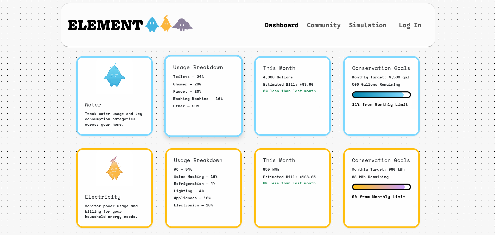
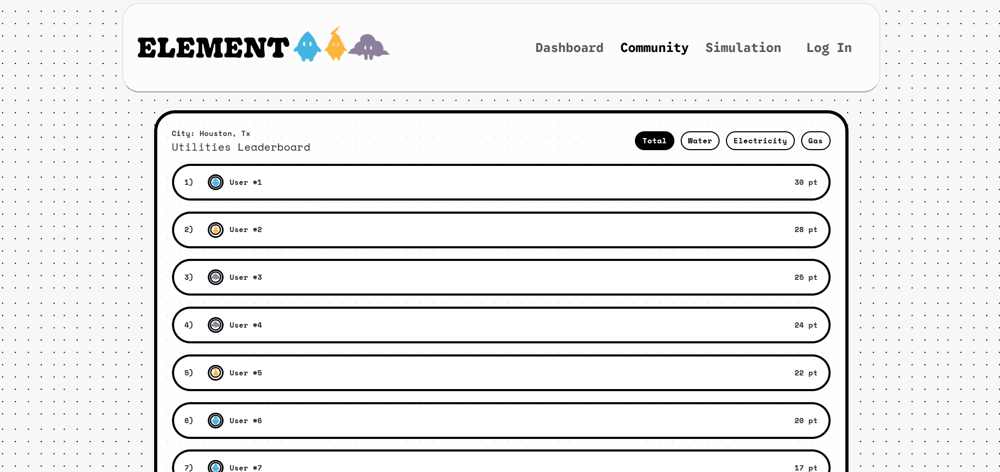
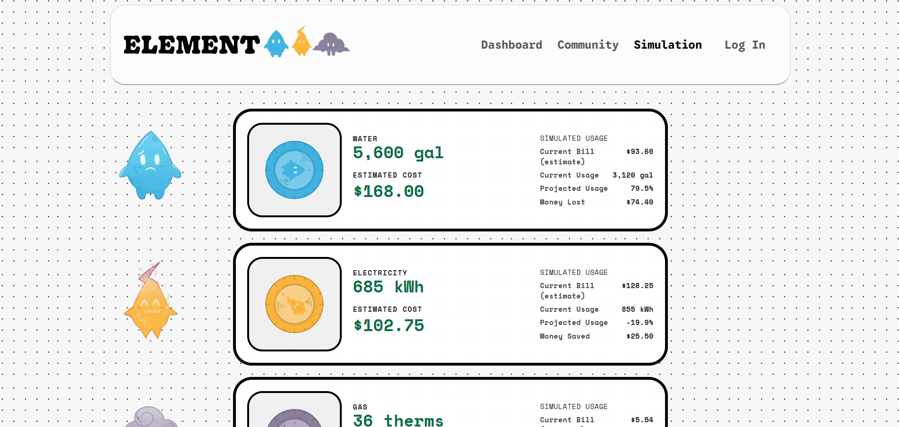
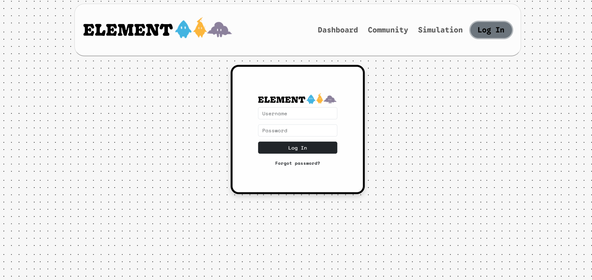
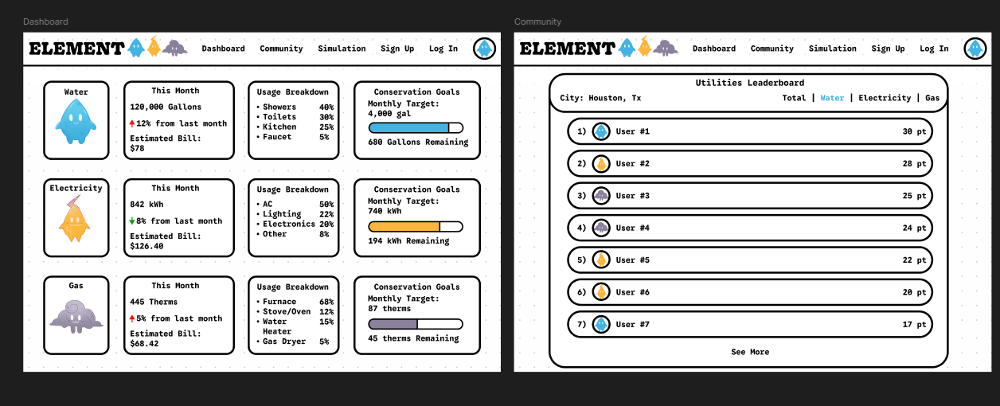
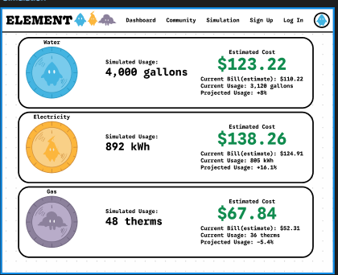

<a id="readme-top"></a>


<!-- PROJECT LOGO -->
<br />
<div align="center">
  <a href="https://github.com/Gingerismycat/element-app">
    
    
    
  </a>

<h3 align="center">ELEMENT</h3>

  <p align="center">
    Household utility tracker dashboard.
    <br />
  </p>
</div>


<!-- TABLE OF CONTENTS -->
<details>
  <summary>Table of Contents</summary>
  <ol>
    <li>
      <a href="#about-the-project">About The Project</a>
      <ul>
        <li><a href="#website-link">Website Link</a></li>
        <li><a href="#built-with">Built With</a></li>
      </ul>
    </li>
    <li>
      <a href="#local-set-up">Local Set Up</a>
      <ul>
        <li><a href="#running-the-website">Running the Website</a></li>
      </ul>
    </li>
    <a href="#usage">Usage</a>
      <ul>
        <li><a href="#dashboard-page">Dashboard Page</a></li>
        <li><a href="#community-page">Community Page</a></li>
        <li><a href="#simulation-page">Simulation Page</a></li>
        <li><a href="#login-page">Log In Page</a></li>
      </ul>
    </li>
    <li><a href="#designs-and-planning">Designs and Planning</a></li>
    <li><a href="#credits">Credits</a></li>
  </ol>
</details>


<!-- ABOUT THE PROJECT -->
## About The Project
<p>Developed for FutureHacks Hackathon.</p>
<p>Our website envisions an intelligent city in the future where smart technology becomes a big part of city infrastructure, managing functions like traffic control and smart waste management.</p>
<p>Element Utilities Hub is a smart home utility dashboard that tracks water, 
gas, and electricity usage in real time. Users can monitor their consumption, 
compare bills, work toward conservation goals, compete on a community 
leaderboard, and simulate different usage scenarios to make more informed 
decisions about their energy habits.</p>
<p>Some elements are made for demonstration purposes only.</p>

<p align="right">(<a href="#readme-top">back to top</a>)</p>

### Website Link
[https://gingerismycat.github.io/element-app/#index](https://gingerismycat.github.io/element-app/#index)
<p align="right">(<a href="#readme-top">back to top</a>)</p>
### Built With


* [![Bootstrap][Bootstrap.com]][Bootstrap-url]


<p align="right">(<a href="#readme-top">back to top</a>)</p>


<!-- GETTING STARTED -->
## Local Set Up

Clone the repo
```sh
git clone https://github.com/Gingerismycat/element-app.git
```
### Running the Website
#### Option 1 — VS Code
Install the **Live Server** extension, right-click `index.html`, select "Open with Live Server".

#### Option 2 — Python
```bash
python -m http.server 8000
```
Then open `http://localhost:8000`.

<p align="right">(<a href="#readme-top">back to top</a>)</p>


<!-- USAGE EXAMPLES -->
## Usage

### Dashboard Page
The Dashboard page allows the user to see the details and estimated costs of their water, electricity, and gas usage along with the progress of their monthly conservation goals. The element sprites display positive emotions if the user is staying true to the monthly limit and negative emotions if the user has surpassed it. If the user is staying within their goals, they are awarded points as shown on the leaderboard on the Community page.


### Community Page
The Community page displays a utilities leaderboard in the user's respective city. The leaderboard provides a list of the users with the most points who have done the best job with utility conservation. The leaderboard has the "total," "water," "electricity," and "gas" filters. Clicking the filter provides the user with information about the points each user has for each respective category.


### Simulation Page
The Simulation page allows the user to adjust their usage with sliders to preview how changes affect their estimated bill. The user is able to compare simulated usage against your current actual usage and see the projected difference as a percentage. The floating element sprites on the left display positive emotions if the simulation benefits the user and negative emotions if it does not. To adjust the usage, click the notch with the element symbol on the left of the card and drag up or right to increase the value and down or left to decrease the value.


### Log In Page
The Log In page is where the user goes to log in into their account to check their Dashboard.



<p align="right">(<a href="#readme-top">back to top</a>)</p>

## Designs and Planning
<p>Speed paint of sprite designs by Claire Sun with scrapped fire sprite</p>

<p>Speed paint of sprite animations by Claire Sun</p>

<p>Figma Dashboard and Community design by Roy Huang</p>

<p>Figma Simulation design by Roy Huang</p>


<p align="right">(<a href="#readme-top">back to top</a>)</p>

## Credits

<p>Vuk Arula - Programming and Implementation</p>
<p>Steven Xu - Programming and Testing</p>
<p>Claire Sun - Sprite Art</p>
<p>Roy Huang - Website and UI Design</p>

Project Link: [https://github.com/Gingerismycat/element-app](https://github.com/Gingerismycat/element-app)

<p align="right">(<a href="#readme-top">back to top</a>)</p>


<!-- MARKDOWN LINKS & IMAGES -->
<!-- https://www.markdownguide.org/basic-syntax/#reference-style-links -->
[contributors-shield]: https://img.shields.io/github/contributors/github_username/repo_name.svg?style=for-the-badge
[contributors-url]: https://github.com/github_username/repo_name/graphs/contributors
[forks-shield]: https://img.shields.io/github/forks/github_username/repo_name.svg?style=for-the-badge
[forks-url]: https://github.com/github_username/repo_name/network/members
[stars-shield]: https://img.shields.io/github/stars/github_username/repo_name.svg?style=for-the-badge
[stars-url]: https://github.com/github_username/repo_name/stargazers
[issues-shield]: https://img.shields.io/github/issues/github_username/repo_name.svg?style=for-the-badge
[issues-url]: https://github.com/github_username/repo_name/issues
[license-shield]: https://img.shields.io/github/license/github_username/repo_name.svg?style=for-the-badge
[license-url]: https://github.com/github_username/repo_name/blob/master/LICENSE.txt
[linkedin-shield]: https://img.shields.io/badge/-LinkedIn-black.svg?style=for-the-badge&logo=linkedin&colorB=555
[linkedin-url]: https://linkedin.com/in/linkedin_username
[product-screenshot]: images/screenshot.png
<!-- Shields.io badges. You can a comprehensive list with many more badges at: https://github.com/inttter/md-badges -->
[Next.js]: https://img.shields.io/badge/next.js-000000?style=for-the-badge&logo=nextdotjs&logoColor=white
[Next-url]: https://nextjs.org/
[React.js]: https://img.shields.io/badge/React-20232A?style=for-the-badge&logo=react&logoColor=61DAFB
[React-url]: https://reactjs.org/
[Vue.js]: https://img.shields.io/badge/Vue.js-35495E?style=for-the-badge&logo=vuedotjs&logoColor=4FC08D
[Vue-url]: https://vuejs.org/
[Angular.io]: https://img.shields.io/badge/Angular-DD0031?style=for-the-badge&logo=angular&logoColor=white
[Angular-url]: https://angular.io/
[Svelte.dev]: https://img.shields.io/badge/Svelte-4A4A55?style=for-the-badge&logo=svelte&logoColor=FF3E00
[Svelte-url]: https://svelte.dev/
[Laravel.com]: https://img.shields.io/badge/Laravel-FF2D20?style=for-the-badge&logo=laravel&logoColor=white
[Laravel-url]: https://laravel.com
[Bootstrap.com]: https://img.shields.io/badge/Bootstrap-563D7C?style=for-the-badge&logo=bootstrap&logoColor=white
[Bootstrap-url]: https://getbootstrap.com
[JQuery.com]: https://img.shields.io/badge/jQuery-0769AD?style=for-the-badge&logo=jquery&logoColor=white
[JQuery-url]: https://jquery.com 